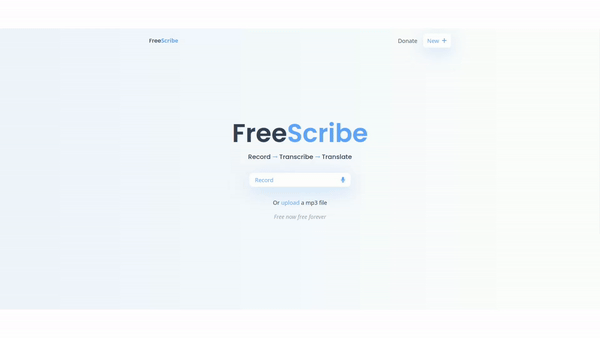

<p align="center">
  <a href="https://atpritam.github.io/Free-Scribe/" target="_blank">
    
  </a>
</p>


# Free-Scribe

[](https://nextjs.org/)
[](https://react.dev/)
[](https://tailwindcss.com/)
[](https://www.npmjs.com/package/@xenova/transformers)
[](https://www.npmjs.com/package/@xenova/transformers)

Deployed: [Free-Scribe](https://atpritam.github.io/Free-Scribe/)

## Audio Transcription and Translation App

## Table of Contents

1. [Introduction](#introduction)
2. [Features](#features)
3. [Usage](#usage)
   - [Recording Audio](#recording-audio)
   - [Uploading Audio Files](#uploading-audio-files)
   - [Transcription](#transcription)
   - [Translation](#translation)
4. [Technologies Used](#technologies-used)
5. [Machine Learning Model Details](#machine-learning-model-details)
   - [Transcription Model](#transcription-model)
   - [Translation Model](#translation-model)
6. [Contributing](#contributing)
7. [License](#license)

## Introduction

Free-Scribe is a powerful Next.js-based web application that leverages machine learning for audio transcription and translation. Built with React 19 and Next.js 15, it provides a user-friendly interface for managing, editing, and translating audio transcriptions, making it an essential tool for content creators, journalists, and language enthusiasts.

## Features

- **Direct Audio Recording**: Record audio directly within the app.
- **Audio File Upload**: Upload audio files for transcription.
- **Transcription**: Transcribe audio to text using advanced ML models.
- **Translation**: Translate transcribed text to multiple languages using ML models.
- **User-friendly Interface**: Easily copy and download transcriptions and translations.
- **Multi-language Support**: Transcribe and translate content in various languages.

## Usage

### Recording Audio

1. Open the app and navigate to the home page.
2. Click on the "Record" button to start recording audio.
3. Click "Stop" to end the recording.
4. The recorded audio will be ready for transcription.

### Uploading Audio Files

1. Click on the "Upload" button.
2. Select an audio file from your device.
3. The uploaded audio file will be ready for transcription.

### Transcription

1. After recording or uploading an audio file, click "Transcribe".
2. The app will process the audio and display the transcribed text.

### Translation

1. Navigate to the "Translation" tab.
2. Select the target language from the dropdown menu.
3. Click "Translate" to translate the transcribed text.

## Technologies Used

- **Next.js 15.5.2**: React framework for production with App Router and server-side rendering capabilities.
- **React 19.1.0**: Front-end library for building user interfaces with the latest React features.
- **TypeScript**: Type-safe JavaScript development for better code quality and developer experience.
- **Web Workers**: For running transcription and translation tasks in the background.
- **TailwindCSS 4.x**: For styling the application with utility-first CSS framework.
- **Machine Learning Models**:
  - **Transcription**: Uses the [`Xenova/whisper-tiny.en`](https://www.npmjs.com/package/@xenova/transformers) model from the `@xenova/transformers` library for automatic speech recognition.
  - **Translation**: Utilizes the [`Xenova/nllb-200-distilled-600M`](https://www.npmjs.com/package/@xenova/transformers) model from the `@xenova/transformers` library for multilingual translation.
- **@xenova/transformers**: A library that provides easy-to-use implementations of state-of-the-art transformer models.

## Machine Learning Model Details

### Transcription Model

- **Task**: Automatic Speech Recognition (ASR)
- **Model**: `Xenova/whisper-tiny.en`
- **Features**:
  - Optimized for English language transcription
  - Supports chunk-based processing for long audio files
  - Provides timestamps for transcribed text

### Translation Model

- **Task**: Translation
- **Model**: `Xenova/nllb-200-distilled-600M`
- **Features**:
  - Supports translation between multiple languages
  - Uses the NLLB (No Language Left Behind) architecture
  - Distilled version for improved performance

Both models are implemented using Web Workers to ensure smooth performance and prevent blocking the main thread during processing.

## Development Setup

This project has been upgraded to Next.js 15 with React 19. To get started with development:

1. **Prerequisites**: Node.js 18+ and npm
2. **Installation**: 
   ```bash
   npm install
   ```
3. **Development Server**:
   ```bash
   npm run dev
   ```
4. **Build for Production**:
   ```bash
   npm run build
   npm start
   ```

The application uses Next.js App Router with TypeScript for type safety and modern React features.

## Contributing

We welcome contributions from the community! Please follow these steps:

1. Fork the repository.
2. Create a new branch: `git checkout -b feature/your-feature-name`
3. Make your changes and commit them: `git commit -m 'Add some feature'`
4. Push to the branch: `git push origin feature/your-feature-name`
5. Open a pull request with a detailed description of your changes.

## License

This project is licensed under the MIT License. See the [LICENSE](LICENSE.md) file for details.
